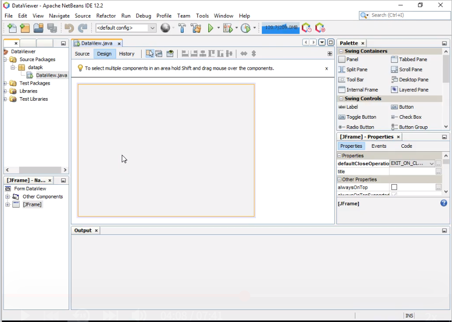
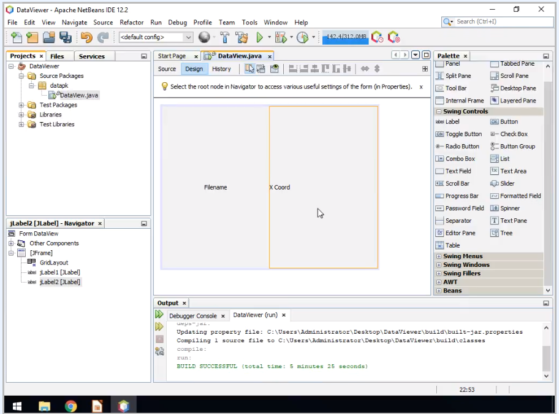
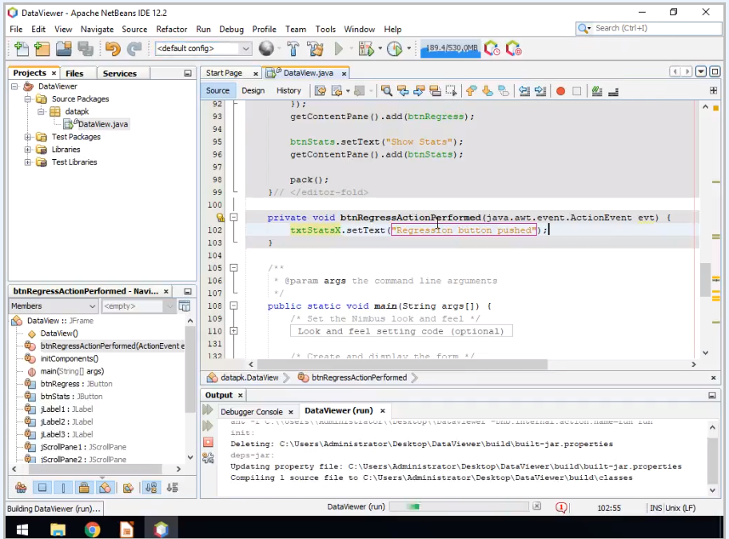

# Use Python and Java to Create a GUI Application

 

### Task 1: Inherit from the JFrame class to create the Application Window:

1. Create the JFrame class. The Jframe has a content pane upon which GUI components are added. These components are called Swing Controls in Netbeans.

 

2. Create the Title. The constructor for the DataView class is where the title for the Jframe is added.

3. Create a minimum size for the Frame.

### Task 2: Add Labels to the grid to tell the user what to enter:

1. Select the Label Swing Control from the Pallet.

2. Create the Labels and add them to the grid.

3. Use the Label Properties to set the Text and Align the text.

Filename Label

X-Coordinate Label

Y-Coordinate Label

4. Observe the code generated in the source view.

Add Line Border for Filename

Follow the same steps for X and Y Coordinates

### Task 3: Use Text Fields to allow the user to enter a filename and X and Y Coordinates for the Python Applications:

1. Select the Text Field from the Swing Control.

2. Add the Text field next to the appropriate Label on the grid.

Add X and Y Coordiantes Text Fields and Change Variable Names

Edit Text for X and Y Coordiantes to Rename

3. Add the Text Areas to display the statistics for X-data and Y data.

Change Variable Names of Text Areas and Run to View Output

### Task 4: Add buttons to the Java GUI to allow users to graph and display statistics:

1. Create the button controls.

Change Variable Name

2. Add each button to the appropriate grid location after Show Regression Button is complete.

Add "Show Stats" button first Change the Variable Name to 
"BtnStats" and then Button Name to "Show Stats".

3. Assign an ActionListener to.

4. Observe how the Action Listener is registered with the button click event.

When the Show Regression Button is pressed it calls the btnRegressActionPerformed method.

### Task 5: Use Java button event handlers to invoke Python Applications:

Python Code in IDLE

1. Implement the event handler methods for each button.

2. Use the Java ProcessBuilder object to invoke the Python code.

Implement Event Handler Methods and ProcessBuilder Object for "Show Stats" Button By Double Clicking.

3. Obtain the data from the text fields for use in the Python program call.

4. Obtain data from the Python program call and insert data into the text areas.

5. Test the completed application.

Source: Use Python and Java to Create a GUI Application, Coursera, Dave Dalsveen
