# Securing and Optimizing Cloud Environments with IBM Cloud Object Storage

## Prerequisites:

You will need an IBM Cloud account to do this lab. If you have not created one already, click on this [link ](https://cf-courses-data.s3.us.cloud-object-storage.appdomain.cloud/IBM-CC0100EN-SkillsNetwork/labs/IBMCloud_accountCreation/CreateIBMCloudAccount.md.html)and follow the instructions to create an IBM Cloud account.

## Create an IBM Cloud Object storage

### Task 1: Create an instance of IBM Cloud Object Storage:

1. Log in to your IBM Cloud account and open the IBM Cloud Catalog [https://cloud.ibm.com/catalog](https://cloud.ibm.com/catalog?utm_source=skills_network&utm_content=in_lab_content_link&utm_id=Lab-IBMDeveloperSkillsNetwork-CC0101EN-SkillsNetwork).
2. On the Catalog page, make sure the **Storage** tab is selected and search and select **Object Storage**:

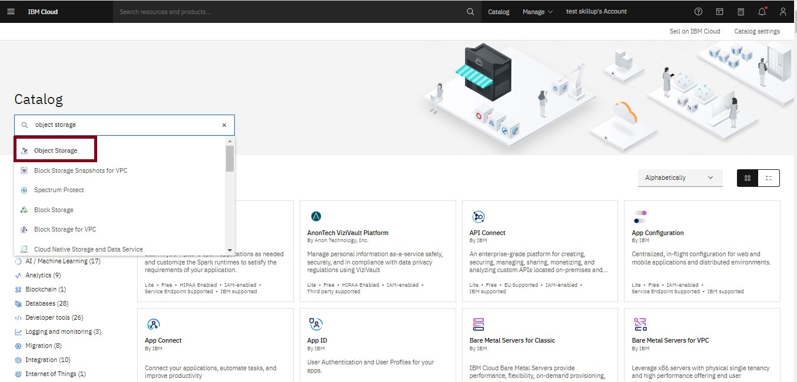 

3. On the [Cloud Object Storage (COS) page](https://cloud.ibm.com/objectstorage/create?utm_source=skills_network&utm_content=in_lab_content_link&utm_id=Lab-IBMDeveloperSkillsNetwork-CC0101EN-SkillsNetwork), choose the Lite plan. You can use the name that is shown in Service name or rename it as you want, accept the Default resource group, and then click Create.

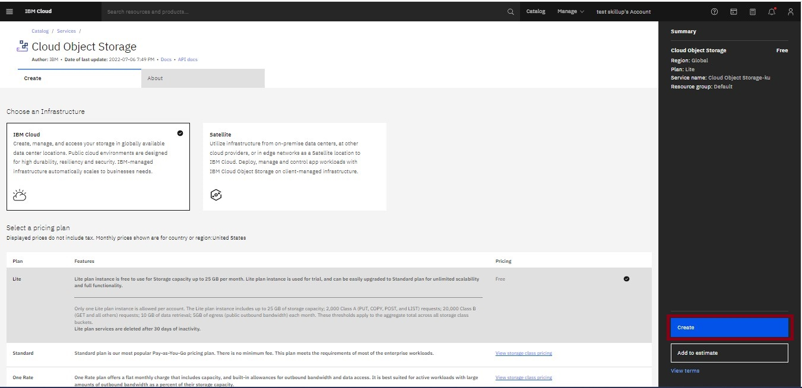

4. Once the Cloud Object Storage (COS) instance is created, you will automatically be directed to the Cloud Object Storage page. Here you can create a bucket and invite users for your Cloud Object Storage instance.

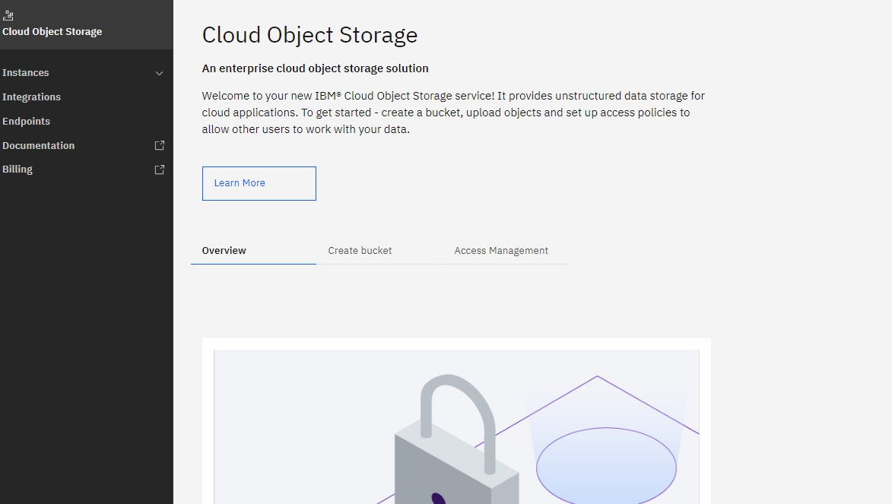

### Task 2: Create a Bucket to store your data:

1. Click on **Instances** in the left navigation pane and select your Object storage instance. Then, click on the **Create bucket** panel.

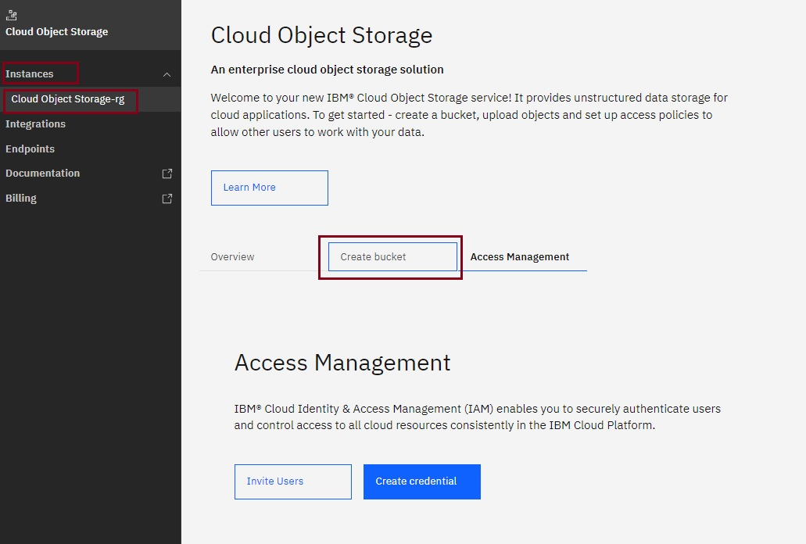

2. Click on the Create Bucket button.

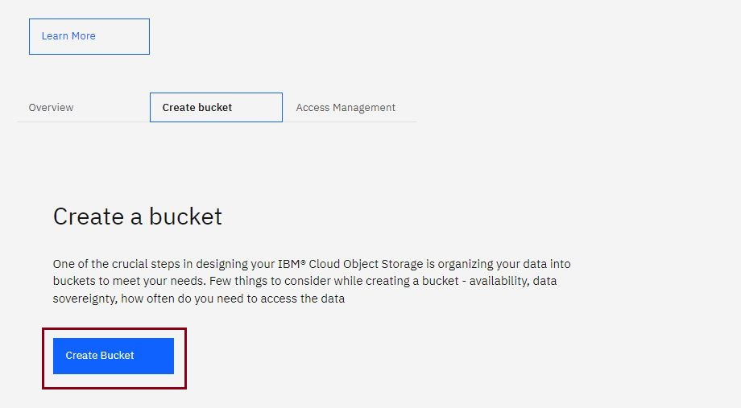

3. Click the right facing arrow under the **Quickly get started** tile.

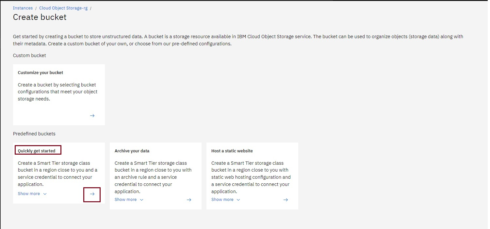

4. Use the pre-assigned name for your bucket and review the pre-configured settings and service credentials and click **Next**.

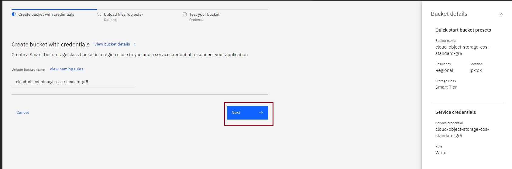

4. The Bucket page appears where you can begin adding objects to the bucket. You can either upload file(s) and then click on **Next**, or click **Next** without uploading any files.

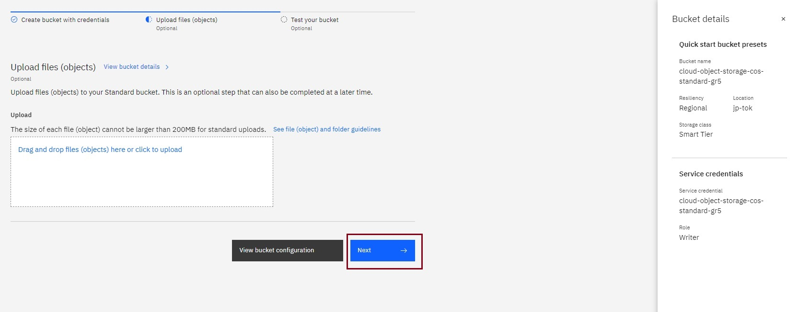

### Task 3: Add Objects to your Bucket:

1. On your Object storage instance's page, click on **View bucket details**.

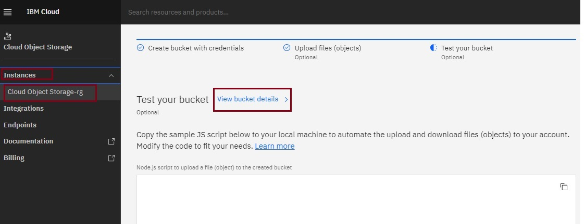

2. The details for the bucket will be displayed.

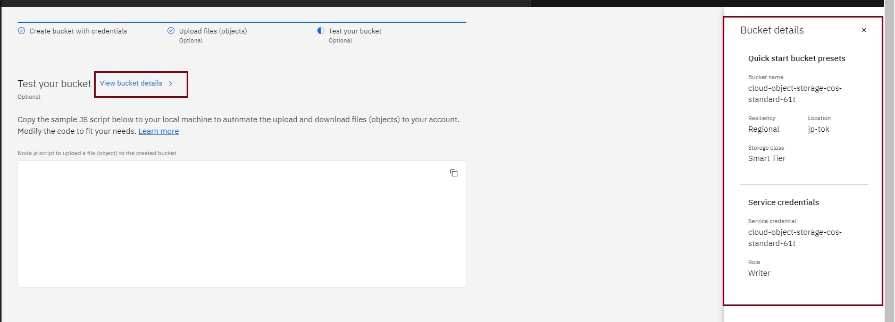

3. In the object storage main page you can see all the buckets under the **Buckets** tab. Select the bucket to which you want to add objects.

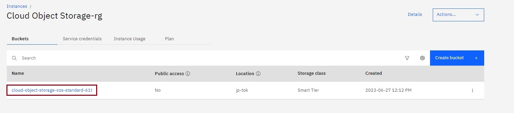

4. For this lab, we’ve provided an HTML file that you can use to add to your bucket. Right click on [Index.html](https://cf-courses-data.s3.us.cloud-object-storage.appdomain.cloud/IBMDeveloperSkillsNetwork-CC0101EN-SkillsNetwork/labs/module%202/data/index.html)
   and click on **Save Link as** or **Save Page as** to save the index.html file to your computer.
5. (Optional) Edit the index.html file to customize it if you like.
6. Click on **Upload** in the **Objects** page.

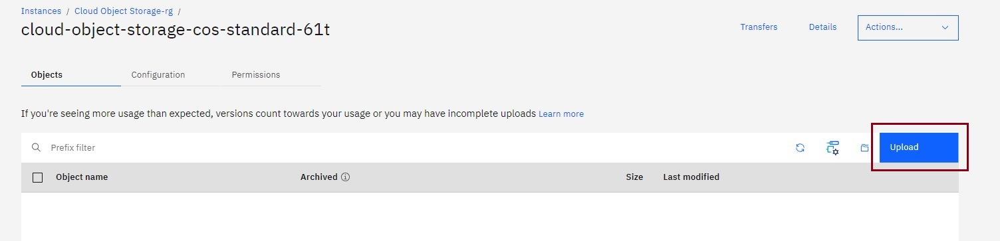

7. Use either the **click to upload** or the **drag and drop files and folders** option to select the index.html file from the appropriate location on your computer.

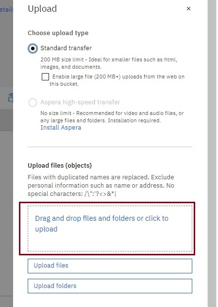

8. Once selected, it will show the file name & size. Click on **Upload**.

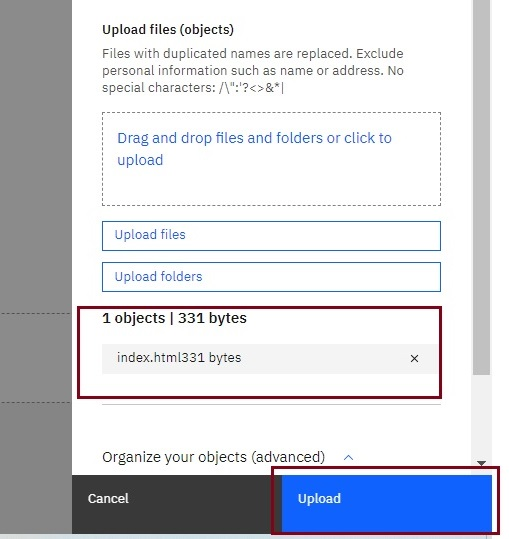

9. Once the file is uploaded, you will see a message like this.

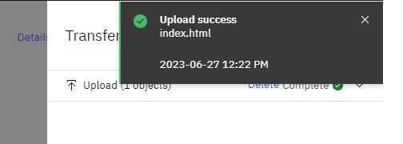

### Task 4: Share Objects in your Bucket:

If you need to share objects in your buckets with other users, you can setup Access Policies. You can set access policies for specific users and groups, or you can choose to make certain buckets public so that anyone can access them (e.g. if you want to host static files on your website).

1. In the Bucket tab, click the three dots option of the bucket that you created. Then click **“Access Policies”**.

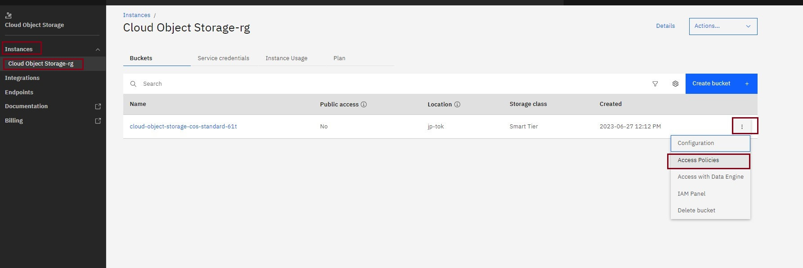

2. Under **Permission** Tab, click **Public Access**.

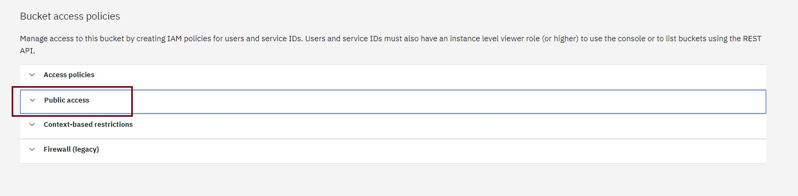

3. When you click on **Public Access**. Click **Create access policy**.

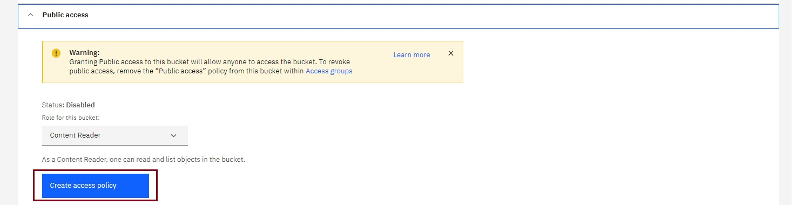

4. Next, a popup window appears. Click **Enable** to allow public access.

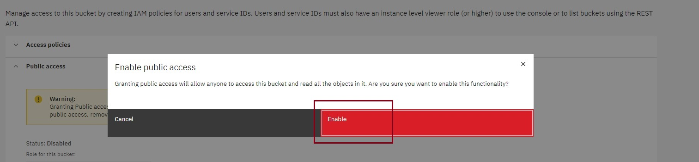

5. Once the access policy is created, you will see a message like this.

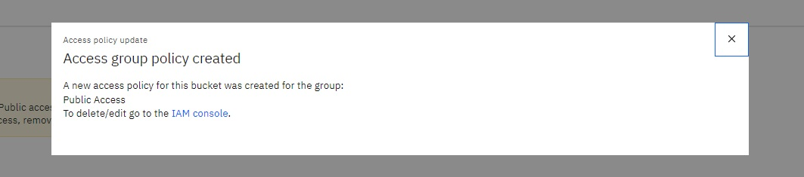

6. On the Buckets page, select the **three dots** option under which you will find **Public URL**.

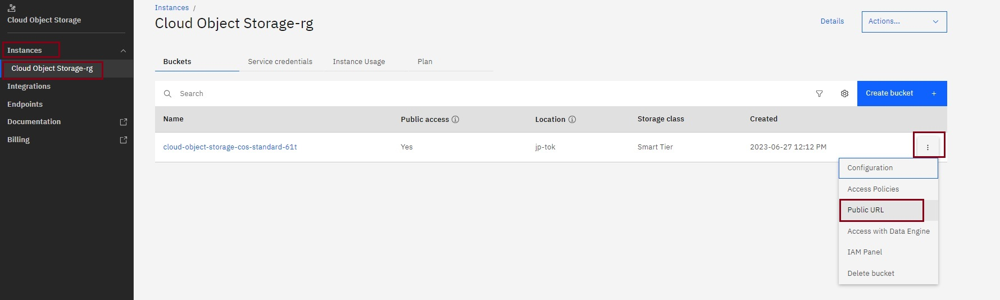

7. This will show your **bucket’s Public URL** in a pop-up. Copy the URL.

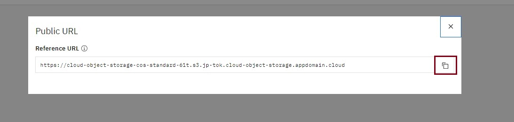

**Note:** If the Object Public URL does not appear, kindly refresh the page as it may take some time to reflect

8. Add /index.html to this link to get the **Object Public URL** which will be similar to ....cloud-object-storage.appdomain.cloud/index.html.

9. Test the **Object public URL** by opening it in your browser. The output will be like this:

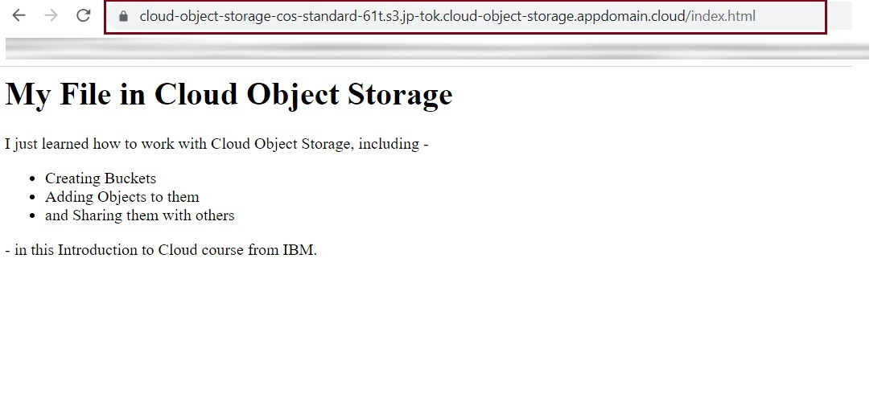

**Source** IBM Skills Network, Priya Kapoor, Lavanya TS, Rav Ahuja, and Upkar Lidder.